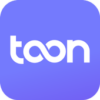
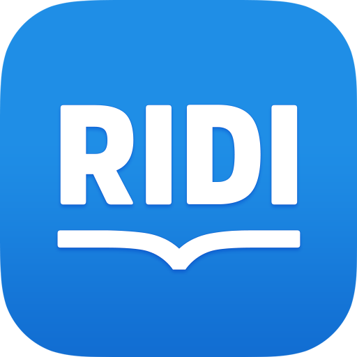

# 이력서
[](http://makeapullrequest.com)


## 소개

- 이름: 이용민
- 군필여부: 병역 필(육군 병장)
- 취미: 산책, 운동, 등산, 달리기, 여행
- Email: dldydals0311@naver.com
- GitHub: [github.com/jspiner](https://github.com/jspiner)


```
엔지니어로 살아가면서, 새로운 것에 대한 도전을 가장 큰 가치로 여기고 있습니다.
```


## Enginnering Ladders
[Engineering Ladders](https://medium.com/@ryanparkdev/engineering-ladders%EC%9D%84-%EC%9D%B4%EC%9A%A9%ED%95%9C-%EC%84%B1%EC%9E%A5%EB%B0%A9%ED%96%A5-%EC%B0%BE%EA%B8%B0-c52112b5c34f)로 표현해본 제 스킬은 이렇습니다.


## 주요경력
- 첨단 X 전력전자 연구실 학부연구생 (2024 ~ 현재)
- 2024 여름학기 모터제어교육 이수 (2024 ~ 2024)
- [리디주식회사](https://www.ridicorp.com/)(2018 ~ 2020)
- [피알앤디컴퍼니](http://prnd.co.kr)(2017 ~ 2018) 
- 프리랜서(2014 ~ 2016)

## 대외활동
- [ifkakao 2022 발표](https://www.youtube.com/watch?v=YXi0eipXBKk) - CI & Remote Build (2022)
- 네이버 부스트캠프 코드 리뷰어(2021)
- Mashup 개발동아리(2017 ~ 2018)
- 소프트웨어 마에스트로 7기(2016 ~ 2017)
- 차세대보안리더 BoB 4기(2015)
- 삼성소프트웨어멤버십 주니어 1기(2014)

## 학력
- 세종대학교 컴퓨터공학과 3학년 휴학(2015 입학)
- 한국디지털미디어고등학교 해킹방어과 졸업(2012 ~ 2014)

## 오픈소스 기여

### airbnb/mavericks
- [Compose에서 viewModel scope를 커스텀하게 잡을경우 생기는 버그 수정](https://github.com/airbnb/mavericks/pull/712)

### Adambl4/mirakle
- [안드로이드 리모트 빌드 환경에서 hostname 변환이 잘못되고 한글이 깨지는 이슈 수정](https://github.com/Adambl4/mirakle/pull/123)

### Sonatype/nexus directjngine
- [파일 경로에 따라 디버그 유틸이 꼬이는 버그 수정 PR](https://github.com/sonatype/directjngine/pull/21)

### PhotoEditor
- [Deprecated 및 크래시 대응](https://github.com/burhanrashid52/PhotoEditor/pull/324)

### TedPermission
- [Travis CI 빌드 관련 설정 수정 PR](https://github.com/ParkSangGwon/TedPermission/pull/66)
- [화면 회전 옵션 추가 및 SDK 버전에 따른 대응 추가 PR](https://github.com/ParkSangGwon/TedPermission/pull/74#issuecomment-363602722)

### RxAndroid
- [오타 수정 PR](https://github.com/ReactiveX/RxAndroid/pull/411)

## 사용 기술
### Android
요구사항 구현을 넘어 프로젝트 개선 및 기술적인 도전을 해볼 수 있을 정도의 안드로이드 스킬을 가지고 있습니다.
- Kotlin, Kotlin DSL
- DI : Dagger / Koin
- Stream : rxJava / coroutine
- View : Compose, Epoxy, Databinding
- Architecture : MVI, MVVM, MVP
- lint + test code

### Backend
클라이언트에 필요한 기술을 테스트하고 검증할 수 있을 정도의 서버 구현 스킬을 가지고 있습니다.
- python - flask/gunicorn
- nodejs
- celery 
- rabbitmq / messageQ / redis
- docker 
- selenium

### Frontend
주변 도움을 받으면 간단한 프로토타입을 만들 수 있을 정도의 스킬을 가지고 있습니다.
- React

그 외 흔히 채용공고에 나오는 이런 '자격요건'들을 경험 해봤습니다.
- 팀 : 기능조직 / 목적조직 / 스쿼드
- 배포 : 정기배포(1주) / 배포자동화 / 단계적배포
- 실험 : AB 테스팅 / deeplink / referrer / Firebase
- 모니터링 : Fabric / Google Analytics / Firebase Analytics
- 커뮤니케이션 : Slack
- 이슈관리 : Github / Jira / Trello / Asana
- CI/CD : TravisCI / Coveralls / Jenkins / SonarQube / Actions
- 디자인 협업 : Zeplin / Figma
- 버전관리 : Git / GitFlow

## 미래에 채워야 하는 것들

## 프로젝트 이력




### 투니스
- 소개: 합법적으로, 공짜로, 누구나 웹툰을 볼 수 있도록 도와주는 서비스
- 사이드 프로젝트로 혼자 서버/백엔드 개발
- 기간 : 2019.01 ~ 2019.12
- 매출 : 8,709,411원



### 리디북스
- 소개: 1등 전자책 서비스
- 기간: 2018.09 ~ 2020.09
- 프로젝트 : 리디페이퍼(3세대) 앱 개발, 웹툰/웹소설용 기능 추가, 유지보수

### 헤이딜러
- 소개: 경매로 내차팔기 서비스
- 기간: 2017.07 ~ 2018.09
- 역할: 유지보수, 신규기능 개발
- 관련기술: MVP, rxJava, databinding, lint, Travis, Fabric, SharedElement Transition, Canvas


### CALY
- 소개: 일정기반 추천서비스 CALY
- 기간: 2016.12 ~ 2017.07
- 역할: 안드로이드 어플리케이션 99%담당, Caldav 프로토콜, api서버 10% 담당, 기술블로그 작성(30%)
- 관련기술: Android, CI/CD(travis), Caldav, 3-legged OAuth, Travis, JIRA(애자일 스프린트), Collaborative Filtering(추천 알고리즘)
- 자세한 설명은 [이 github 그룹](https://github.com/CalyFactory)에 있습니다.
- 기술블로그는 [이 링크](https://calyfactory.github.io/)에서 보실수 있으며, [저장소는 여기](https://github.com/CalyFactory/CalyFactory.github.io)입니다.(기여도 30%)


### Surfinger
- 소개: 슬랙 봇 기반 타자게임
- 기간: 2016.09 ~ 2016.12
- 역할: 주요 게임로직, 멀티프로세싱 처리 (전체 447커밋중 193커밋을 기여함)
- 관련기술: python, Message-Q, worker, Multiprocessing, RealTimeMessaging(Socket), newrelic
- 자세한 설명은 [이 github 저장소](https://github.com/JSpiner/Soma_SlackBot_taja)에 있습니다.

## 수상 경력
취미로 해커톤을 종종 나가곤 합니다. <br/>
**프로젝트에 도입해볼까?** 하는 신기술들을 <br/>
해커톤에서 간단하게 적용해보고 프로젝트에 도입해보곤 합니다.

### KakaoMobility X GCP Cloud Heo - 사내 3위
- 수상 날짜 : 2024년 4월

### KakaoMobility X GCP Cloud Hero - 사내 3위
- 수상 날짜 : 2023년 05월
 
#### 세종대학교 메이커톤 2020 - 우수상
- 수상 날짜 : 2020년 12

#### 서울 스타트업 윅엔드 2019 - Creativity(2위)
- 수상 날짜 : 2019년 11월

#### 미세먼지 해커톤 - 우수상
- 수상 날짜 : 2019년 6월

#### 9xD GDG Planet 해커톤 - Best Helper(개인수상), Zone중하상 수상(팀)
- 수상 날짜 : 2018년 9월

#### Unithon 대학생 연합 해커톤 - NH 농협은행상
- 수상 날짜 : 2018년 1월

#### 오사카 스타트업 윅엔드 2017 - 1st Place(1위)
- 해외 해커톤
- 수상 날짜 : 2017년 12월

#### 인천 글로벌 스타트업 윅엔드 2017 - 1st Place(1위)
- 수상 날짜 : 2017년 10월 
- 관련정보 : https://github.com/JSpiner/know-your-kids

#### Unithon 대학생 연합 해커톤 - 최우수상
- 수상 날짜: 2017년 2월
- 관련정보 : https://github.com/unithon4th

#### 강원랜드 메이커톤 - 대상(1등위)
- 수상 날짜 : 2017년 1월

<br/>
<br/>

### 이 이외에도 [30+개의 수상실적](https://github.com/JSpiner/RESUME/blob/master/AWARDS.md)이 있습니다. 
(너무 길어져 생략합니다. [AWARDS.md에서](https://github.com/JSpiner/RESUME/blob/master/AWARDS.md) 확인해주세요)

부족한 부분이나 더 궁금하신 내용이 있다면 [이슈](https://github.com/JSpiner/RESUME/issues)로 남겨주시겨나, jspiner@naver.com으로 연락주세요.<br/>
감사합니다.
